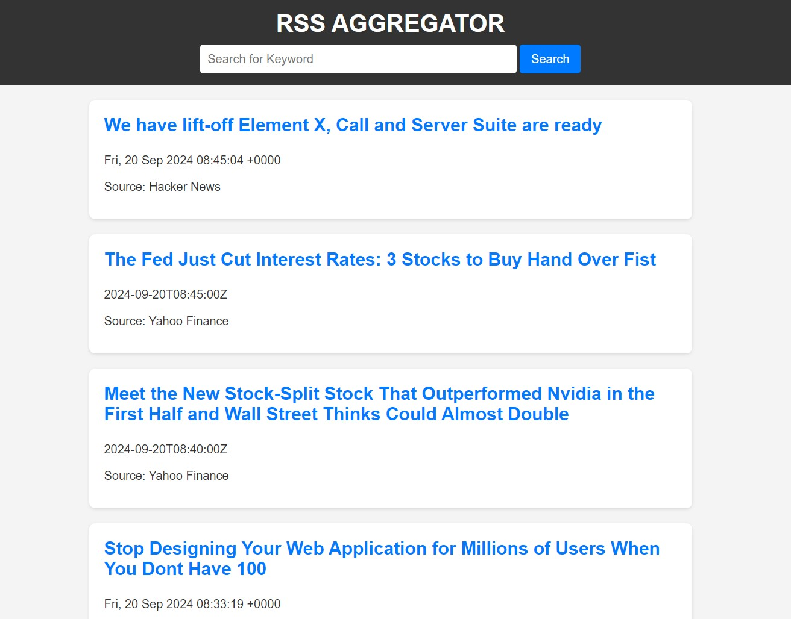
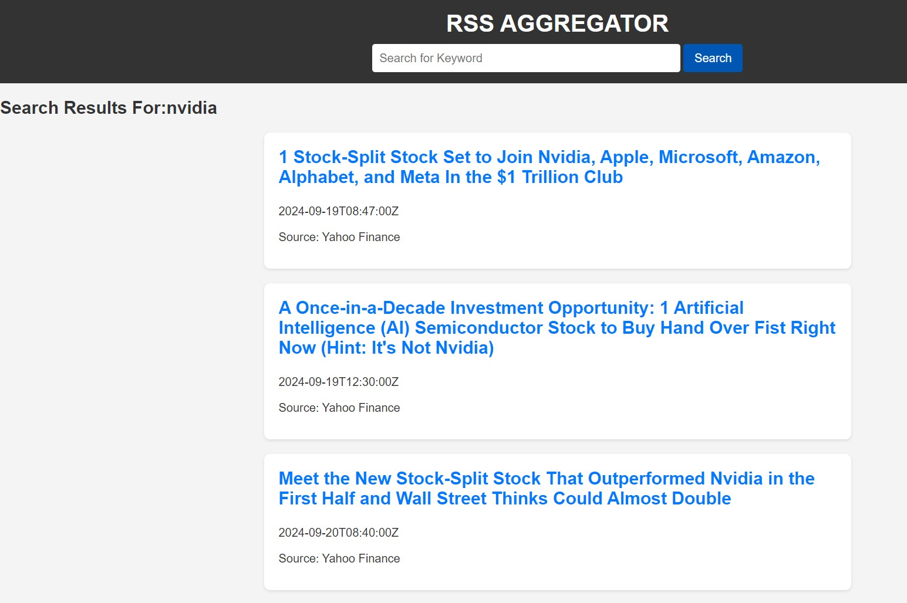

# RSS Feed Aggregator and Search App Using Flask

## Overview
The **RSS Feed Aggregator and Search App** is a web application that fetches and displays the latest articles from multiple news sources, allowing users to stay updated in real-time. The app also includes a search functionality to filter articles by keywords. It is built using **Flask** and parses RSS feeds from popular news websites.

## Features
- **Real-time Aggregation:** Fetches and aggregates **40+ news articles** from **4 major sources**:  
  - Yahoo Finance  
  - Hacker News  
  - Wall Street Journal  
  - CNBC  
- **Pagination:** Displays **10 articles per page** to make navigation more user-friendly.
- **Keyword Search:** Allows users to search articles by keywords across **100+ entries** in real-time.
- **Locally Hosted:** Runs on **Flask** on your local machine (localhost:5000).

## Technologies Used
- **Python** – Core programming language for backend.
- **Flask** – Web framework for routing and handling requests.
- **Feedparser** – Parses the RSS feeds.
- **HTML/CSS** – Frontend structure and styling.
- **JavaScript** – Provides interactivity in the web app.
- **Jinja2** – Template engine for rendering dynamic content in Flask.

## Setup and Installation

### Prerequisites
Make sure you have the following installed on your machine:
- **Python 3.x**
- **Flask** (`pip install flask`)
- **Feedparser** (`pip install feedparser`)

### Project Structure
'''rss-aggregator/ 
│ 
├── app.py # Main Flask app 
├── templates/
│ ├── index.html # Homepage template for displaying articles 
│ └── search.html # Template for search results 
├── static/ 
│ ├── style.css # Custom CSS for styling the app 
│ └── script.js # JavaScript for any client-side interactivity 
├── screenshots/ 
│ ├── homepage.png # Screenshot of homepage 
│ └── search.png # Screenshot of search functionality 
└── requirements.txt # List of dependencies
'''
## Screenshots

### Homepage Screenshot

### Search Page Screenshot

